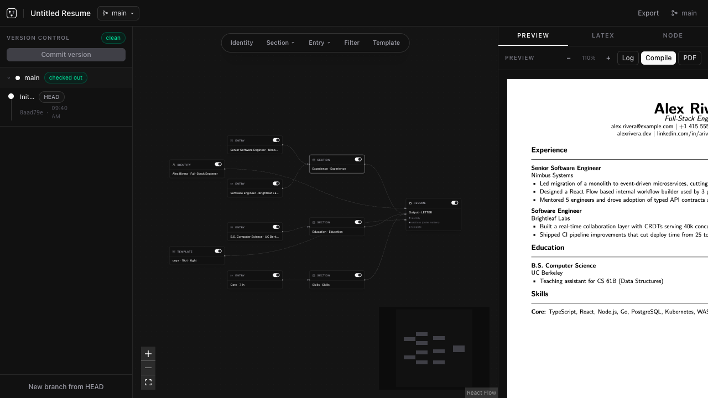
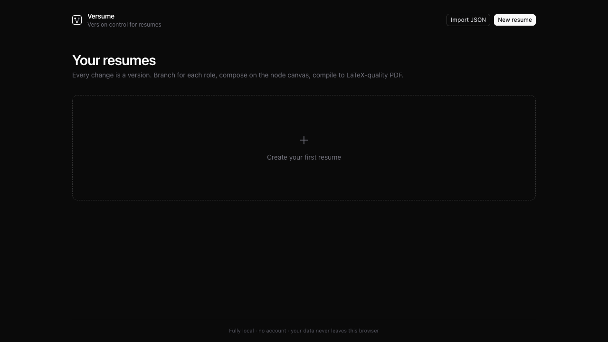
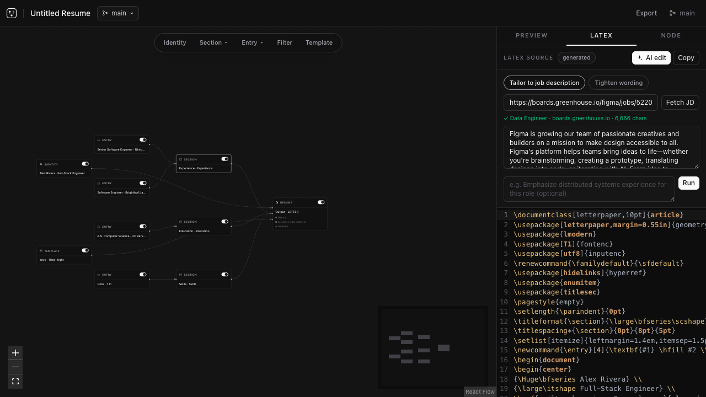
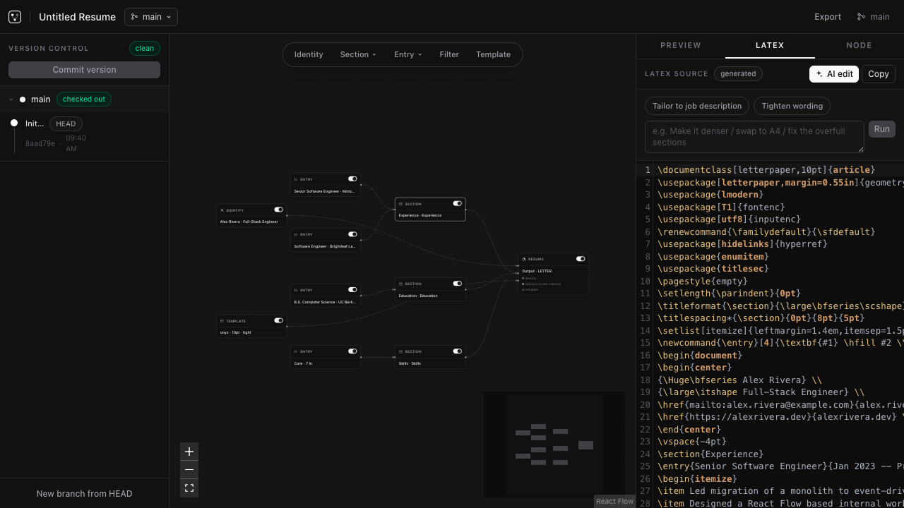
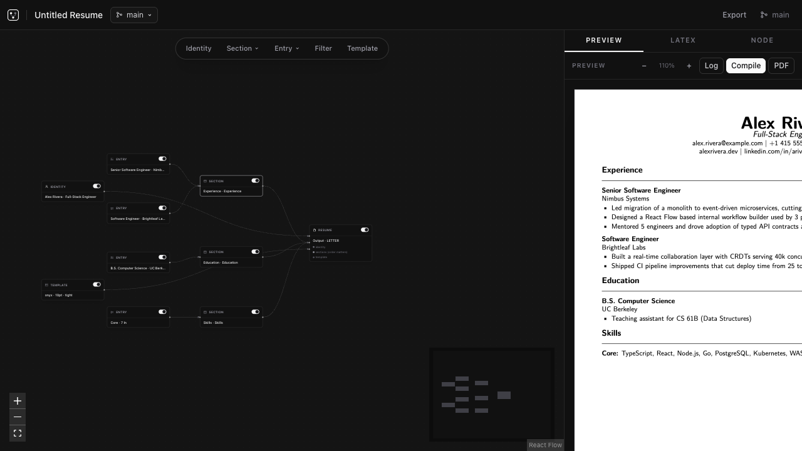

<div align="center">

# Versume

**Version control for resumes** — branch, commit, and compose your resume like code, with a visual node canvas, an in-browser LaTeX compiler, and AI tailoring that reads any job posting.

[](https://versumehq.vercel.app/)


</div>

<br />

<p align="center"><em>The studio canvas: your resume as a node graph — identity, sections, entries, filters all wired into a single output node.</em></p>

<p align="center"></p>

<br />

## What it is

Each resume is a **DAG of immutable versions** with named branch pointers. A **visual node graph** (not a document) decides what gets generated and in what order; a **WebAssembly pdfTeX engine** compiles the result to a real PDF entirely in your browser; and an **AI panel** lets Gemini retarget the source to any job description you paste a link to — all local, no account, no server.

- **Git-style versioning, minus the plumbing.** Branch from any version (e.g. `acme-staff-swe`, `short-cv`), check out any point in history, commit snapshots with messages. Every edit is preserved; nothing is ever deleted, only disconnected.
- **Visual scripting canvas** (React Flow). Identity, sections (experience / education / projects / skills / …), individual entries, templates and filters are nodes; the wires into the `Resume` output node decide exactly what gets generated and in what order. Reorder sections by rewiring, toggle entries per role, or drop in filter nodes (keyword boost, limit). 
- **In-browser LaTeX toolchain.** A WebAssembly pdfTeX engine (SwiftLaTeX) compiles the generated source to a real PDF client-side. The TeX file tree (`public/texlive`) and the prebuilt format file are served statically — no server dependency. A CodeMirror LaTeX editor shows the generated source and supports full manual override per version.
- **AI LaTeX editing from a job link.** The LaTeX tab's AI panel is backed by Gemini via **Firebase AI Logic** (`gemini-3.6-flash`), secured with **Firebase App Check** (reCAPTCHA Enterprise). Quick actions — fix compile errors from the log, tailor to a job description, tighten wording — plus freeform instructions. Paste any job-board URL (Greenhouse, Lever, Ashby, LinkedIn…) and the [**Jina Reader**](https://r.jina.ai/) fetches the full posting right inside the panel; Gemini then retargets your source to it. Revisions apply as a **per-version source override**, so AI edits are captured in version snapshots like any other change.
- **Fully local, no auth.** All state lives in IndexedDB. Export/import complete history as JSON. A `StorageProvider` seam is wired in so a remote/authenticated provider can be dropped in later without touching the UI.

<br />

## Tour

<p align="center"><strong>1 · Resume library</strong> — every resume, its branch, and its edit state, one click away.</p>
<p align="center"></p>

<br />

<p align="center"><strong>2 · AI panel · tailor to a job link</strong> — paste any posting URL, Jina Reader fetches the JD in the browser, Gemini rewrites the source.</p>
<p align="center"></p>

<br />

<p align="center"><strong>3 · AI panel · quick actions & freeform instructions</strong> — fix compile errors from the log, tighten wording, or describe any edit.</p>
<p align="center"></p>

<br />

<p align="center"><strong>4 · In-browser PDF</strong> — the tailored source compiles to a real PDF, client-side, no server.</p>
<p align="center"></p>

<br />

## Stack

- **Next.js** (static export, `output: "export"`) + **TypeScript** + **Tailwind v4**
- `@xyflow/react` for the node canvas
- **SwiftLaTeX** pdfTeX WASM engine (`public/latex`) + self-hosted **TeX Live** subset (`public/texlive`)
- **CodeMirror 6** (stex mode) for LaTeX editing, **pdf.js** for preview
- **Zustand** + **idb-keyval** for state and persistence
- **Firebase AI Logic** + **App Check** for the Gemini integration, **Jina Reader** for job-description extraction

## Architecture notes

- `lib/types.ts` — the serializable schema: `ResumeDoc → Branch/Version → GraphState → VNode/VEdge`. Nodes are a discriminated union by `kind` (`identity | section | entry | template | filter | output`).
- `lib/graph/compile.ts` — resolves the graph from the output node backwards (sections in `sectionOrder`, entries in `entryOrder`, filters applied in-flow) and emits LaTeX.
- `lib/graphql/template.ts` — onyx (sans) and quartz (serif) Latin Modern preamble templates.
- `lib/storage/provider.ts` — `StorageProvider` interface with a `LocalProvider` (IndexedDB) implementation. A remote/authenticated provider can be dropped in without touching the UI.
- `lib/llm/provider.ts` — `LLMProvider` interface for future graph-level tailoring. The `llmTailor` filter node already stores its job-description prompt inside version snapshots.
- `lib/llm/firebase.ts` + `lib/llm/config.ts` — the live Gemini integration used by the LaTeX tab's AI panel (App Check attested, client-side only).
- `lib/llm/jd.ts` — the Jina Reader client; reads a job-board URL, strips noise, caps to the token budget, and surfaces a friendly error for 404 / login-walled / empty pages.
- `lib/latex/engine.ts` — lazy singleton around the WASM engine. First compile per session fetches the prebuilt `swiftlatexpdftex.fmt`; everything else is fetched lazily from `/texlive`.

## Development

```bash
npm install
npm run dev     # http://localhost:3000
npm run build   # static export to out/
```

The Firebase and Jina keys live in `lib/llm/config.ts` (client-side by design for this local build — swap for your own before shipping).

## Deploy

Static export — any static host works. With Vercel: `vercel --prod`.

## Status & roadmap

- ✅ Visual canvas, version DAG, in-browser compile, AI tailoring from a job link, Jina Reader
- 🚧 Merge support for branches (currently branch-from + checkout)
- 🚧 Wire a real provider to the graph-level `llmTailor` filter (interface + node schema ready)
- 🚧 DAG visualization for version history (currently a lineage list)
- ⏳ Lighter cold start (progressive font / format loading)

## License

MIT.
